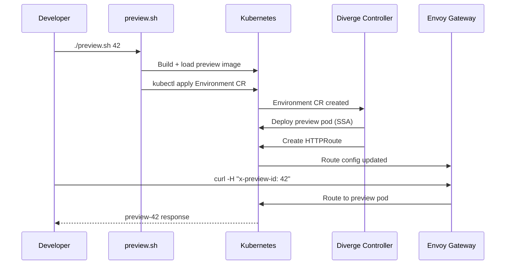

# 🏦 Diverge Bank Demo

> **See multi-repo preview environments in action.** One cluster, four microservices, header-based routing — powered by the Diverge controller.

## What This Demo Shows

A developer opens a PR on `payments-api`. Without touching any other service:

```
curl http://localhost:8080/api/payments              → baseline v1
curl -H "x-preview-id: 42" http://localhost:8080/api/payments  → preview v2 ✨
```

The **same request** to `accounts-api`, `gateway`, or `web-app` hits the baseline — only the changed service is replaced. This is the **mesh-first preview** pattern.

## Architecture

```
                    ┌─────────────┐
                    │ Envoy       │
    HTTP Request ──▶│ Gateway     │
                    │ (port 80)   │
                    └──────┬──────┘
                           │
              ┌────────────┼────────────────┐
              │            │                │
        ┌─────▼─────┐ ┌───▼────┐    ┌──────▼──────┐
        │  web-app   │ │gateway │    │ baseline    │
        │  (BFF)     │ │ (BFF)  │    │ HTTPRoute   │
        └────────────┘ └───┬────┘    └─────────────┘
                           │
              ┌────────────┼────────────┐
              │                         │
        ┌─────▼──────┐          ┌──────▼──────┐
        │payments-api│          │accounts-api │
        │ (baseline) │          │ (baseline)  │
        └────────────┘          └─────────────┘
              │
              │  x-preview-id: 42
              │  (header match)
              ▼
        ┌────────────┐
        │payments-api│
        │ (preview)  │ ← deployed by Diverge controller
        └────────────┘
```

## Quick Start (5 minutes)

### Prerequisites

| Tool | Install |
|------|---------|
| Docker | [docker.com](https://docs.docker.com/get-docker/) |
| k3d | `brew install k3d` or [k3d.io](https://k3d.io) |
| kubectl | `brew install kubectl` |
| helm | `brew install helm` |
| curl | Pre-installed on macOS/Linux |
| jq | `brew install jq` or [jqlang.org](https://jqlang.org) |

### 1. Start the demo

```bash
cd bank-demo
./scripts/setup.sh
```

This creates a k3d cluster and deploys:
- **Envoy Gateway** — Kubernetes Gateway API implementation
- **Diverge controller** — manages preview environment lifecycle
- **4 bank services** — payments, accounts, gateway (BFF), web app

### 2. Verify baseline

```bash
curl -s http://localhost:8080/api/payments | jq .
```
```json
{
  "service": "payments-api",
  "version": "baseline",
  "accounts_response": { "service": "accounts-api", "version": "baseline" }
}
```

### 3. Create a preview environment

```bash
./scripts/preview.sh 42
```

This simulates a developer opening PR #42 on `payments-api`:
1. 🔨 Builds a preview image with code changes
2. 📦 Loads the image into the k3d cluster
3. 🚀 Creates an `Environment` custom resource
4. ⏳ The Diverge controller reconciles: deploys preview pod + creates HTTPRoute

### 4. Test header-based routing

```bash
# Baseline — no header, hits original payments-api
curl -s http://localhost:8080/api/payments | jq .version
# → "baseline"

# Preview — header routes to preview payments-api
curl -s -H "x-preview-id: 42" http://localhost:8080/api/payments | jq .version
# → "preview-42"

# Other services — still baseline (header passes through, no preview deployed)
curl -s -H "x-preview-id: 42" http://localhost:8080/api/accounts | jq .version
# → "baseline"
```

### 5. Run multiple previews

```bash
./scripts/preview.sh 43
./scripts/preview.sh 44

# Each preview is isolated
curl -s -H "x-preview-id: 42" http://localhost:8080/api/payments | jq .version  # → "preview-42"
curl -s -H "x-preview-id: 43" http://localhost:8080/api/payments | jq .version  # → "preview-43"
curl -s -H "x-preview-id: 44" http://localhost:8080/api/payments | jq .version  # → "preview-44"
```

### 6. Inspect the Environment CR

```bash
kubectl get environment -n demo-bank
# NAME         AGE
# preview-42   2m
# preview-43   1m
# preview-44   30s

kubectl get pods -n demo-bank
# NAME                              READY   STATUS    RESTARTS   AGE
# accounts-api-xxx                  1/1     Running   0          5m
# payments-api-xxx                  1/1     Running   0          5m  ← baseline
# gateway-xxx                       1/1     Running   0          5m
# web-app-xxx                       1/1     Running   0          5m
# payments-api-preview-42-xxx       1/1     Running   0          2m  ← preview
# payments-api-preview-43-xxx       1/1     Running   0          1m  ← preview
# payments-api-preview-44-xxx       1/1     Running   0          30s ← preview

kubectl get httproute -n demo-bank
# NAME                    AGE
# baseline-routes         5m
# preview-42-payments     2m   ← auto-created by controller
# preview-43-payments     1m
# preview-44-payments     30s
```

### 7. Clean up

```bash
# Remove one preview
./scripts/cleanup.sh 42

# Remove all previews
./scripts/cleanup.sh 43
./scripts/cleanup.sh 44

# Tear down the entire demo
./scripts/setup.sh teardown
```

## Automated Smoke Test

```bash
./scripts/verify.sh
```

Runs a full lifecycle test: baseline → preview → routing → cleanup.

## How It Works



## What's Different From the "Real" Flow

In production, the Diverge controller is triggered by **webhooks** from GitHub/GitLab — not by a script. When a developer opens a PR:

1. GitHub sends a webhook to the Diverge controller
2. Controller fetches `.diverge.yaml` from the PR branch
3. Controller creates the Environment CR automatically
4. CI/CD builds and pushes the preview image
5. Controller deploys the preview and sets up routing

This demo simulates steps 1-4 locally so you can see the preview mechanism in action without configuring webhooks.

## Service Repositories

| Service | Role | Port |
|---------|------|------|
| [demo-payments-api](https://github.com/divergedev/demo-payments-api) | Payment processing, calls accounts-api | 8080 |
| [demo-accounts-api](https://github.com/divergedev/demo-accounts-api) | Account management | 8080 |
| [demo-gateway](https://github.com/divergedev/demo-gateway) | API gateway / BFF, fans out to backend services | 8080 |
| [demo-web-app](https://github.com/divergedev/demo-web-app) | Frontend, calls gateway | 8080 |

Each service has a `.diverge.yaml` that configures preview behavior:
```yaml
apiVersion: diverge.io/v1alpha1
kind: ServicePreview
metadata:
  name: payments-api
spec:
  serviceName: payments-api
  namespace: demo-bank
  port: 8080
  routing:
    headerKey: x-preview-id
  container:
    env:
      - name: ACCOUNTS_API_URL
        value: http://accounts-api:8080
```
